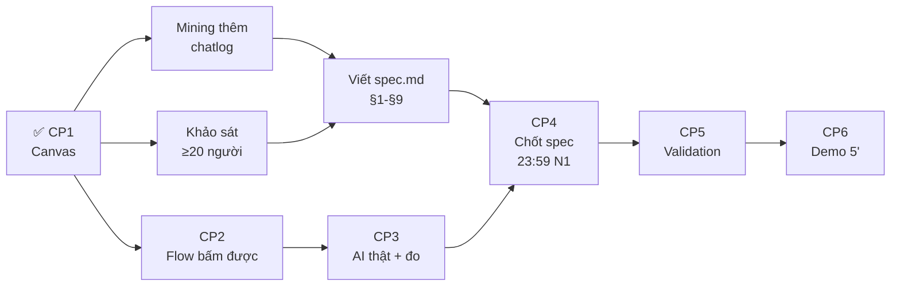

# 📋 CANVAS CP1 — VLearn Tutor · Trả lời có trích dẫn
## Nhóm 2A202601217 · Nguyễn Văn Đại

> **Format:** Canvas 7 dòng theo [guide §1.5](file:///Users/phaihoang/Documents/DAY05_2A202601217_NguyenVanDai/02-guide.md#L47-L50)
> **Mốc:** CP1 · Chốt Canvas

---

### 1️⃣ Hướng

**Hướng A — VLearn** · Loại: Tối ưu tính năng có sẵn (AI tutor)

---

### 2️⃣ Job executor

**Học viên đang ôn bài hoặc xem lại nội dung bài giảng trên VLearn** — cụ thể: học viên cần tra lại một khái niệm hoặc kiến thức đã được giảng trong buổi học, sử dụng AI tutor để hỏi và mong nhận câu trả lời có cơ sở từ tài liệu bài giảng.

---

### 3️⃣ Pain — một câu

**Học viên** đang **tra lại kiến thức từ bài giảng qua AI tutor**, nhưng **vướng ở chỗ tutor trả lời mà không trích dẫn nguồn cụ thể** (trang nào, đoạn nào) → **hậu quả: học viên không biết thông tin có đúng không, phải tự tìm lại trong tài liệu/video (mất 5-15 phút), hoặc tin nhầm kiến thức sai mà không kiểm chứng được.**

---

### 4️⃣ Bằng chứng đầu tiên (Evidence B — Mining)

**Từ chatlog thật** ([chat_history_anonymized_for_hackathon.csv](file:///Users/phaihoang/Documents/DAY05_2A202601217_NguyenVanDai/data/vlearn-pack/chatlog/chat_history_anonymized_for_hackathon.csv) · 2,522 dòng · 1,261 cặp hỏi-đáp · 369 user):

| Metric | Con số | Ý nghĩa |
|---|---|---|
| Tỷ lệ tutor trả lời **không có citation** | **46.2%** (582/1,261 lượt) | Gần **1/2 số câu trả lời** không có nguồn |
| Rating tiêu cực (`down`) | 37/70 lượt có rating (53%) | Hơn nửa feedback là tiêu cực |
| Tutor hỏi lại kiểm tra hiểu | 3/2,515 (~0.1%) | Gần như **không bao giờ** hỏi lại |

**5 ví dụ nguyên văn từ chatlog:**

1. **Tutor không tìm thấy nội dung slide** (C0001):
   > *"Xin lỗi bạn, tôi không tìm thấy nội dung cụ thể cho slide 37 trong tài liệu hiện có. Bạn có thể cung cấp thêm thông tin hoặc tiêu đề của slide đó để tôi có thể hỗ trợ bạn chính xác hơn không?"*
   → citations: `[]` — không cite gì

2. **Tutor trả lời có cite** (C0002):
   > *"Dựa trên nội dung tại trang 45, có 4 chiến lược chính để tối ưu hóa prompt..."*
   → citations: `[45]` — có cite → **đây là happy path cần nhân rộng**

3. *(Cần bổ sung thêm 3 ví dụ cụ thể từ việc mining sâu chatlog — tìm case tutor trả lời dài nhưng citations rỗng)*

**Phương pháp đếm:** Đếm field `citations` trong tất cả 1,261 message có role = `tutor`. Citations = `[]` tính là không có trích dẫn. Ai cũng có thể kiểm lại bằng cách filter CSV.

---

### 5️⃣ Lát cắt — MỘT CÂU

> **Một học viên** đang ôn bài, **hỏi AI tutor về một khái niệm trong bài giảng** · AI **tìm đoạn transcript liên quan và trả lời kèm trích dẫn mã đoạn `[Txx-NNN]`** · học viên **nhận câu trả lời có nguồn, click vào trích dẫn để đọc nguyên văn giảng viên nói.**

---

### 6️⃣ Automation + lý do

**Mức: Conditional** — AI tự trả lời kèm trích dẫn khi tìm thấy đoạn transcript phù hợp; khi **không tìm thấy căn cứ** trong transcript → AI **thông báo rõ** "Mình không tìm thấy nội dung liên quan trong bài giảng" thay vì bịa.

**Lý do theo cost-of-error:**
- **Nếu AI cite đúng:** học viên tiết kiệm 5-15 phút tìm lại → rẻ, lợi lớn.
- **Nếu AI cite sai đoạn:** học viên đọc đoạn không liên quan → mất thời gian nhưng tự phát hiện được → chi phí sửa **trung bình**.
- **Nếu AI bịa kiến thức không có trong transcript:** học viên **học sai** mà không biết → chi phí **đắt** (sai kiến thức, ảnh hưởng đến bài thi/thực hành).
- → **Không automate hoàn toàn** vì sai kiến thức domain là đắt. Nhưng **không chỉ augment** vì nếu tutor lúc nào cũng phải có người duyệt thì mất tính real-time. → **Conditional** là phù hợp: tự tin thì trả lời, không chắc thì nói rõ giới hạn.

---

### 7️⃣ Willing users dự kiến + Phân công

**Willing users (≥3 người ngoài nhóm sẵn sàng thử prototype):**

| # | Tên | Vai trò | Lý do chọn |
|---|---|---|---|
| 1 | *(Bổ sung tên thật)* | Học viên khoá AI | Hay dùng VLearn tutor để ôn bài |
| 2 | *(Bổ sung tên thật)* | Học viên khoá AI | Đã phản ánh tutor trả lời không rõ nguồn |
| 3 | *(Bổ sung tên thật)* | Học viên khoá AI | Thuộc zone khác, góc nhìn khách quan |

> [!WARNING]
> **Cần bổ sung ngay:** Hỏi 3 bạn học viên ngoài nhóm đồng ý thử prototype. Ghi tên cụ thể.

**Phân công có tên:**

| Phần việc | Người phụ trách |
|---|---|
| **Spec + Canvas** | Nguyễn Văn Đại |
| **Evidence (mining chatlog + khảo sát)** | *(Bổ sung tên)* |
| **Prompt engineering + Golden set** | *(Bổ sung tên)* |
| **Code / Prototype** | *(Bổ sung tên)* |
| **Demo + Validation** | *(Bổ sung tên)* |

> [!NOTE]
> Nếu làm một mình, ghi tên mình cho tất cả các phần.

---

## ✅ Checklist tự soát CP1

- [x] Hướng đã chọn: A — VLearn
- [x] Job executor cụ thể (không phải "học viên nói chung")
- [x] Pain một câu: ai — đang làm gì — vướng đâu — hậu quả
- [x] Evidence đầu tiên có con số đếm được (46.2%)
- [x] Lát cắt đúng format: 1 user · 1 việc · 1 quyết định AI · 1 kết quả
- [x] Automation chọn + lý do theo cost-of-error
- [ ] ⚠️ Willing users: **CẦN BỔ SUNG TÊN CỤ THỂ**
- [ ] ⚠️ Phân công: **CẦN BỔ SUNG TÊN THÀNH VIÊN** (nếu làm nhóm)

---

## 📌 Bước tiếp theo sau CP1

| Việc cần làm ngay | Ưu tiên |
|---|---|
| Bổ sung 3 tên willing users | 🔴 Cao |
| Mining thêm chatlog: tìm 5 ví dụ nguyên văn tutor trả lời không cite | 🔴 Cao |
| Dựng UI flow chính (mock): ô nhập câu hỏi → AI trả lời + cite → click xem nguồn | 🟡 Trung bình |
| Thử gọi Gemini API với 1 transcript nhỏ | 🟡 Trung bình |
| Viết spec.md theo template §1-§9 | 🟡 Trung bình |

# 📋 CANVAS CP1 — VLearn Tutor · Trả lời có trích dẫn
## Nhóm 2A202601217 · Nguyễn Văn Đại

> **Format:** Canvas 7 dòng theo [guide §1.5](file:///Users/phaihoang/Documents/DAY05_2A202601217_NguyenVanDai/02-guide.md#L47-L50)
> **Mốc:** CP1 · Chốt Canvas

---

### 1️⃣ Hướng

**Hướng A — VLearn** · Loại: Tối ưu tính năng có sẵn (AI tutor)

---

### 2️⃣ Job executor

**Học viên đang ôn bài hoặc xem lại nội dung bài giảng trên VLearn** — cụ thể: học viên cần tra lại một khái niệm hoặc kiến thức đã được giảng trong buổi học, sử dụng AI tutor để hỏi và mong nhận câu trả lời có cơ sở từ tài liệu bài giảng.

---

### 3️⃣ Pain — một câu

**Học viên** đang **tra lại kiến thức từ bài giảng qua AI tutor**, nhưng **vướng ở chỗ tutor trả lời mà không trích dẫn nguồn cụ thể** (trang nào, đoạn nào) → **hậu quả: học viên không biết thông tin có đúng không, phải tự tìm lại trong tài liệu/video (mất 5-15 phút), hoặc tin nhầm kiến thức sai mà không kiểm chứng được.**

---

### 4️⃣ Bằng chứng đầu tiên (Evidence B — Mining)

**Từ chatlog thật** ([chat_history_anonymized_for_hackathon.csv](file:///Users/phaihoang/Documents/DAY05_2A202601217_NguyenVanDai/data/vlearn-pack/chatlog/chat_history_anonymized_for_hackathon.csv) · 2,522 dòng · 1,261 cặp hỏi-đáp · 369 user):

| Metric | Con số | Ý nghĩa |
|---|---|---|
| Tỷ lệ tutor trả lời **không có citation** | **46.2%** (582/1,261 lượt) | Gần **1/2 số câu trả lời** không có nguồn |
| Rating tiêu cực (`down`) | 37/70 lượt có rating (53%) | Hơn nửa feedback là tiêu cực |
| Tutor hỏi lại kiểm tra hiểu | 3/2,515 (~0.1%) | Gần như **không bao giờ** hỏi lại |

**5 ví dụ nguyên văn từ chatlog:**

1. **Tutor không tìm thấy nội dung slide** (C0001):
   > *"Xin lỗi bạn, tôi không tìm thấy nội dung cụ thể cho slide 37 trong tài liệu hiện có. Bạn có thể cung cấp thêm thông tin hoặc tiêu đề của slide đó để tôi có thể hỗ trợ bạn chính xác hơn không?"*
   → citations: `[]` — không cite gì

2. **Tutor trả lời có cite** (C0002):
   > *"Dựa trên nội dung tại trang 45, có 4 chiến lược chính để tối ưu hóa prompt..."*
   → citations: `[45]` — có cite → **đây là happy path cần nhân rộng**

3. *(Cần bổ sung thêm 3 ví dụ cụ thể từ việc mining sâu chatlog — tìm case tutor trả lời dài nhưng citations rỗng)*

**Phương pháp đếm:** Đếm field `citations` trong tất cả 1,261 message có role = `tutor`. Citations = `[]` tính là không có trích dẫn. Ai cũng có thể kiểm lại bằng cách filter CSV.

---

### 5️⃣ Lát cắt — MỘT CÂU

> **Một học viên** đang ôn bài, **hỏi AI tutor về một khái niệm trong bài giảng** · AI **tìm đoạn transcript liên quan và trả lời kèm trích dẫn mã đoạn `[Txx-NNN]`** · học viên **nhận câu trả lời có nguồn, click vào trích dẫn để đọc nguyên văn giảng viên nói.**

---

### 6️⃣ Automation + lý do

**Mức: Conditional** — AI tự trả lời kèm trích dẫn khi tìm thấy đoạn transcript phù hợp; khi **không tìm thấy căn cứ** trong transcript → AI **thông báo rõ** "Mình không tìm thấy nội dung liên quan trong bài giảng" thay vì bịa.

**Lý do theo cost-of-error:**
- **Nếu AI cite đúng:** học viên tiết kiệm 5-15 phút tìm lại → rẻ, lợi lớn.
- **Nếu AI cite sai đoạn:** học viên đọc đoạn không liên quan → mất thời gian nhưng tự phát hiện được → chi phí sửa **trung bình**.
- **Nếu AI bịa kiến thức không có trong transcript:** học viên **học sai** mà không biết → chi phí **đắt** (sai kiến thức, ảnh hưởng đến bài thi/thực hành).
- → **Không automate hoàn toàn** vì sai kiến thức domain là đắt. Nhưng **không chỉ augment** vì nếu tutor lúc nào cũng phải có người duyệt thì mất tính real-time. → **Conditional** là phù hợp: tự tin thì trả lời, không chắc thì nói rõ giới hạn.

---

### 7️⃣ Willing users dự kiến + Phân công

**Willing users (≥3 người ngoài nhóm sẵn sàng thử prototype):**

| # | Tên | Vai trò | Lý do chọn |
|---|---|---|---|
| 1 | *Phạm Trung Kiên* | Học viên khoá AI | Hay dùng VLearn tutor để ôn bài |
| 2 | *Nguyễn Huy Anh* | Học viên khoá AI | Đã phản ánh tutor trả lời không rõ nguồn |
| 3 | *Hà Tấn Phong* | Học viên khoá AI | Thuộc zone khác, góc nhìn khách quan |

> [!WARNING]
> **Cần bổ sung ngay:** Hỏi 3 bạn học viên ngoài nhóm đồng ý thử prototype. Ghi tên cụ thể.

**Phân công có tên:**

| Phần việc | Người phụ trách |
|---|---|
| **Spec + Canvas** | Nguyễn Văn Đại |
| **Evidence (mining chatlog + khảo sát)** | *Phạm Bá Thượng Hải* |
| **Prompt engineering + Golden set** | *Hoàng Văn Phái* |
| **Code / Prototype** | *Hoàng Văn Phái* |
| **Demo + Validation** | *Nguyễn Văn Đại + Phạm Bá Thượng Hải* |

> [!NOTE]
> Nếu làm một mình, ghi tên mình cho tất cả các phần.

---

## ✅ Checklist tự soát CP1

- [x] Hướng đã chọn: A — VLearn
- [x] Job executor cụ thể (không phải "học viên nói chung")
- [x] Pain một câu: ai — đang làm gì — vướng đâu — hậu quả
- [x] Evidence đầu tiên có con số đếm được (46.2%)
- [x] Lát cắt đúng format: 1 user · 1 việc · 1 quyết định AI · 1 kết quả
- [x] Automation chọn + lý do theo cost-of-error
- [ ] ⚠️ Willing users: **CẦN BỔ SUNG TÊN CỤ THỂ**
- [ ] ⚠️ Phân công: **CẦN BỔ SUNG TÊN THÀNH VIÊN** (nếu làm nhóm)

---

## 📌 Bước tiếp theo sau CP1

| Việc cần làm ngay | Ưu tiên |
|---|---|
| Bổ sung 3 tên willing users | 🔴 Cao |
| Mining thêm chatlog: tìm 5 ví dụ nguyên văn tutor trả lời không cite | 🔴 Cao |
| Dựng UI flow chính (mock): ô nhập câu hỏi → AI trả lời + cite → click xem nguồn | 🟡 Trung bình |
| Thử gọi Gemini API với 1 transcript nhỏ | 🟡 Trung bình |
| Viết spec.md theo template §1-§9 | 🟡 Trung bình |
